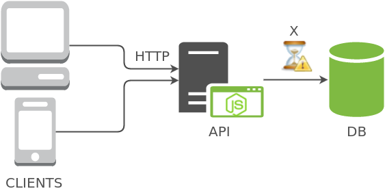

#0 - INTRODUÇÃO

---

### [Voltar (README)](../README.md)

---

### Contexto

Vamos começar falando um pouco sobre o NodeJS, a plataforma que possibilita tudo o que vai ser dito
nesta apresentação. Atualmente ela tem ganhado muito impulso, incentivo e defensores pelo mundo.
Desde IBM, Intel, Microsoft, PayPal, SAP e Netflix, até a entrada do JS Foundation no Linux
Foundation.
Mas apesar do apoio desses gigantes do mercado e suas aplicações, você sabia que o NodeJS trabalha
com uma única thread para o gerenciamento do código? A tempos que aplicações em geral usam
multi-threading para aumentar sua performance. Então como que o NodeJS tornou o inviável, arcaico e
não-escalável numa das plataformas mais usadas e preferidas do momento?

Aplicações frequentemente precisam buscar recursos de fontes externas, como informações de um banco
de dados, de uma API de terceiros ou até mesmo um arquivo no filesystem. Isso pode demandar um
tempo indeterminado.
Para essas operações específicas, o NodeJS conta com uma **Thread Pool** de 4 threads: **Filesystem**
para manusear arquivos e pastas, **Network** para comunicação na rede, **Process** para abrir processos
externos, e **Other** para qualquer outro tipo de operação.
Para a aplicação não ficar totalmente estática e esperando, o gerenciador de eventos
**Single-Threaded** chamado de **Event Loop** delega o processamento desses recursos externos às suas
respectivas threads do **Thread Pool**. Para saber em que trecho do código prosseguir depois que o
recurso é resgatado, um **Evento** é registrado no **Event Queue**, onde ficam todas as operações
assíncronas. Depois disso, o **Event Loop** interrompe essa linha de execução e continua com outras
para executar. Por causa deste comportamento, o NodeJS é caracterizado como **Non-blocking I/O**.
Finalmente, quando o recurso é recebido, é disparado o **Evento** previamente registrado e aquele
código "pausado" é retomado para finalizar o seu processamento.

NodeJS APIs - com métodos em versões sync e async
- FS (readFile, writeFile, appendFile, etc);
- HTTP/NET (request, get, post, etc);
- etc;

Agora vejamos o cenário hipotético abaixo:

Imagine que estamos naquele sisteminha maroto e precisamos fazer uma listagem básica de usuários
com suas imagens de perfil salvas em 500x500 formato base64. Finalmente, o sistema deve salvar num
arquivo de de log físico do servidor informações detalhadas da operação.
A ordem lógica desse fluxo deve ser algo como:

1. Acessar URL;
2. Front-end faz uma requisição HTTP GET para a API;
3. Back-end recebe um GET na rota específica;
4. Back-end registra a requisição no log;
5. Back-end executa a query no banco de dados e retorna JSON com registros;
6. Front-end recebe os dados e renderiza HTML;

Tempos de execução:
- Escrever no log: 5000ms
- Consultar no DB: 15000ms

Fazendo esse fluxo de forma síncrona, teremos que esperar a escrita no arquivo de log antes mesmo de
poder começar a pensar na execução da query. Sendo que um não tem relação direta com o outro e
poderiam ocorrer paralelamente, agilizando o processo.

No cenário síncrono, o tempo total é de **20 segundos**. É a **soma** das operações.
Fazendo de forma assíncrona, o tempo total é de **15 segundos**. É o valor do mais demorado.

Neste caso é só uma escrita em log, mas poderia ser mais muito complexo e pesado. Esses tempos numa
aplicação grande podem ser maiores, e temos que diminuí-los o máximo possível. Afinal ninguem quer
navegar numa página e ver uma rosquinha girando indefinidamente numa tela de loading. Portanto,
vamos usar a natureza assíncrona do NodeJS ao nosso favor para resolver isso!

---

### [Avançar (1 - Callbacks)](../1_callbacks/README.md)

---
